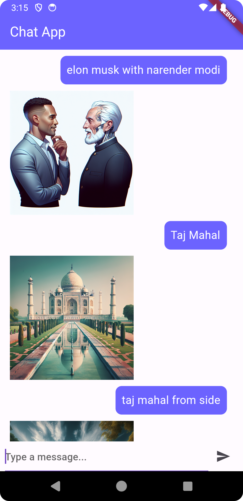

# AI Image Generator App

A Flutter application that utilizes AI to generate unique and creative images.

## Table of Contents

- [Introduction](#introduction)
- [Features](#features)
- [Getting Started](#getting-started)
  - [Prerequisites](#prerequisites)
  - [Installation](#installation)
- [Usage](#usage)


- [Acknowledgments](#acknowledgments)

## Introduction

This Flutter application leverages artificial intelligence to generate diverse and interesting images. The AI model employed in this app is designed to produce visually appealing content, making it a fun and creative tool for users.

## Features

- AI-powered image generation
- Simple and intuitive user interface
- Customizable settings for image generation

## Getting Started

Follow the instructions below to get the app up and running on your local machine.

### Prerequisites

- [Flutter](https://flutter.dev/) installed on your machine
- Emulator or physical device for testing

### Installation

1. Clone the repository:

   ```bash
   git clone https://github.com/sehaj23/AI-image-generator-flutter.git
   cd ai-image-generator-app
   flutter pub get


  Usage
Open the project in your preferred Flutter development environment.

Run the app on an emulator or physical device:


```bash
  flutter run
```


Explore the app and enjoy the AI-powered image generation!


# Contributing
Contributions are welcome! If you find any bugs or have suggestions for improvement, please open an issue or submit a pull request. Make sure to follow the contributing guidelines.


# Acknowledgments
The AI model used in this app is based on Chatgpt Dalle
Special thanks to the Flutter community for their support and contributions.


# Screenshot

